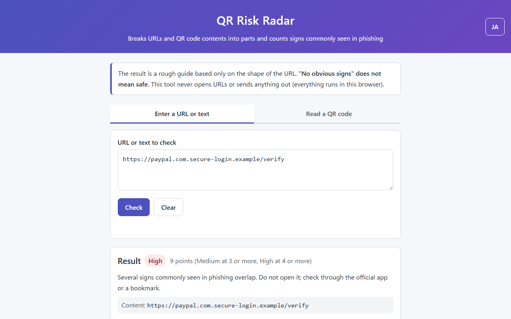
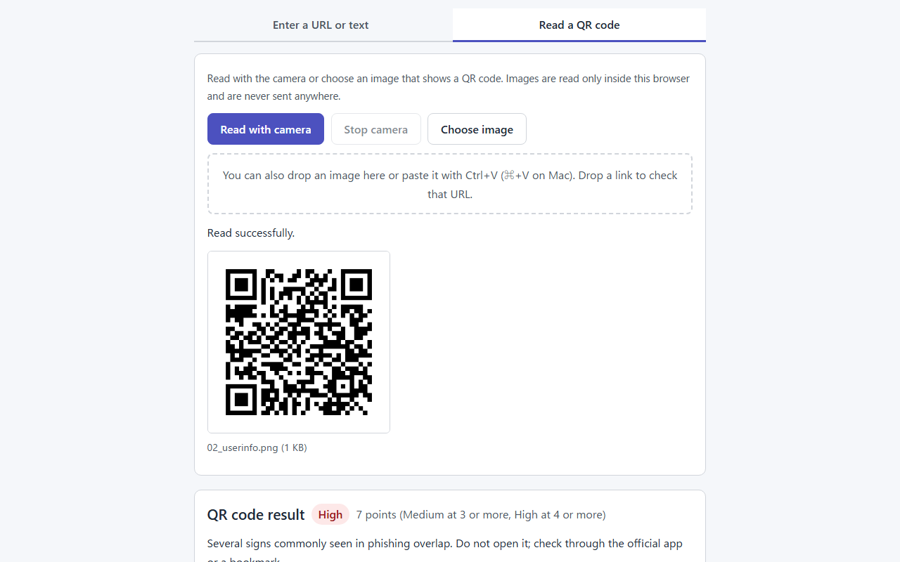
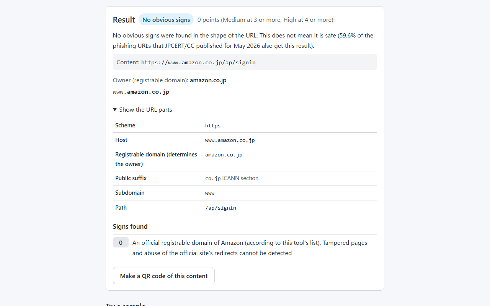
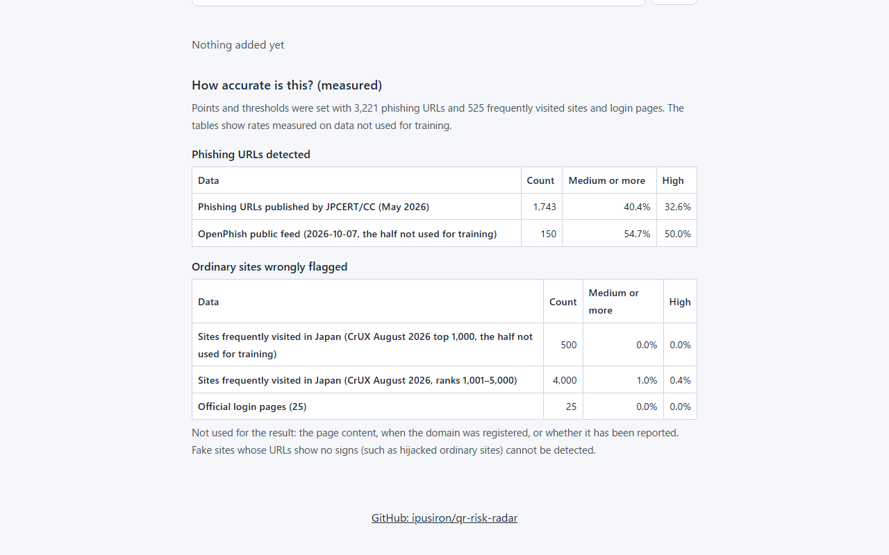
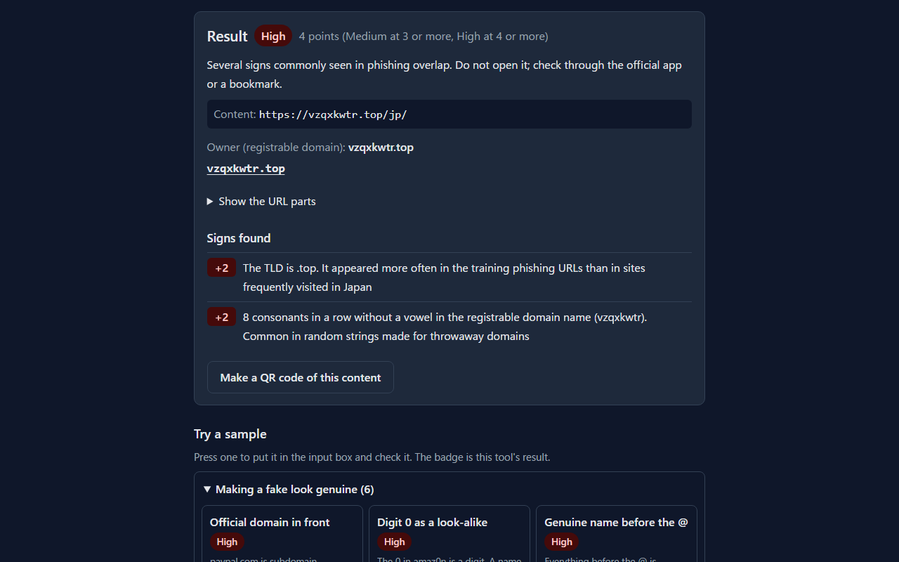
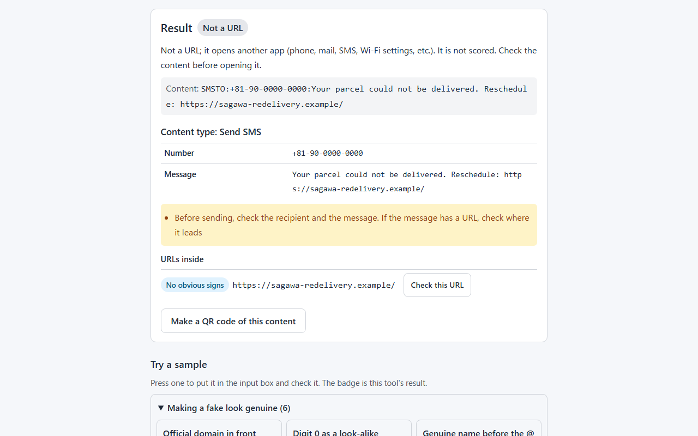
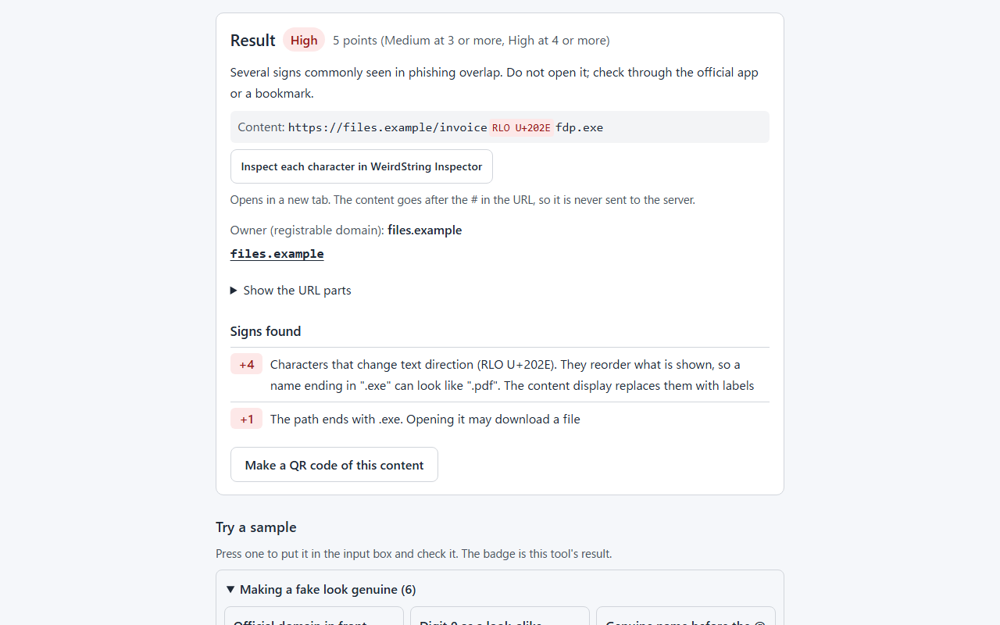

English · [日本語](README.md)

# QR Risk Radar - QR Code Risk Analysis Tool


[](https://ipusiron.github.io/qr-risk-radar/)

**Day074 - 100 Security Tools with Generative AI**

**QR Risk Radar** is a web tool that breaks URLs and QR code contents into parts and counts signs commonly seen in phishing.

It reads QR codes from the camera or an image, clearly shows the part that determines the owner (the registrable domain), and adds up points per sign to give "High", "Medium", or "No obvious signs". Contents other than URLs, such as Wi-Fi settings, SMS, contacts, and two-factor authentication keys, are also broken into fields with notes on what to watch for. Direction-changing characters (RLO) and invisible characters are replaced with labels and shown in their actual order. The points and thresholds were set with real phishing URLs and sites frequently visited in Japan, and the measured accuracy is shown on the page. Everything runs in the browser; the tool never opens URLs or sends anything out.

---

## 🌐 Demo

👉 **[https://ipusiron.github.io/qr-risk-radar/](https://ipusiron.github.io/qr-risk-radar/)**

Try it directly in your browser.

---

## 📸 Screenshots

>
>*A fake URL with an official domain in front. The owner is secure-login.example and the result is High (9 points)*

>
>*Reading a QR code image. www.amazon.co.jp before the @ is decoration; the destination is login-check.example*

>
>*A genuine official site (amazon.co.jp) with the URL parts open, showing the public suffix co.jp and the registrable domain*

>
>*Measured accuracy: the detection and false-flag rates on data not used for training*

>
>*Dark mode. A random-string domain (.top) rated High (4 points)*

>
>*Content type. An SMS with a URL in the message, broken into number, message, notes, and the URL inside with its result*

>
>*A direction-changing character (RLO). The content is shown in its actual order with a label, and a button opens WeirdString Inspector*

---

## ✨ Features

- Owner: shows the host name split into the subdomain (light text) and the registrable domain (bold, underlined). The registrable domain is found with the Public Suffix List, so you can see that the owner of `paypal.com.secure-login.example` is `secure-login.example`
- URL parts: lists the scheme, the part before the @, the host, its display form (internationalized domain names), the public suffix and its section, the subdomain, port, path, query, and fragment
- Signs and points: looks for 28 kinds of signs and lists the points and an explanation for each. A total of 3 points or more is "Medium" and 4 or more is "High". `javascript:`, `data:`, and similar schemes are always "High"
- Hidden destinations: extracts URLs embedded in the query and URLs or email addresses written in Base64, and checks that destination with one button
- Content types: breaks Wi-Fi settings, phone numbers, SMS, email, contacts (vCard, MECARD), locations, two-factor authentication keys, crypto payment addresses, events, and app launches into fields. Shows notes such as unencrypted Wi-Fi, paid information lines, and two-factor secrets, and checks the URLs inside. Passwords and secret keys are masked and shown only when you press a button
- Invisible and direction-changing characters: reports direction-changing characters such as RLO and invisible characters such as zero-width spaces and tag characters as signs. The content display replaces them with labels such as `[RLO U+202E]` and shows the text in its actual order (so the trick that makes a name ending in ".exe" look like ".pdf" is visible on the screen)
- Works with WeirdString Inspector: content with Japanese or invisible characters can be passed with a button to [WeirdString Inspector](https://ipusiron.github.io/weirdstring-inspector/) (Day023) to inspect each character. The content goes after the # in the URL, so it is never sent to the server
- Read QR codes: from the camera (the rear camera on phones) or an image file. When nothing can be read, the previous result is cleared and the reason is shown
- Paste and drop: paste an image with Ctrl+V (⌘+V on Mac) or drop it on the page to read it as a QR code. Drop a link to check that URL
- Make QR codes: turns the checked content into a QR code PNG, for training materials or for testing scanners
- Measured accuracy: shows the "detected" and "wrongly flagged" rates measured on data not used for training
- Domains you trust: add registrable domains you have verified, such as your company's sites, to show them as "Trusted". Public suffixes (`co.jp`, `pages.dev`, etc.) cannot be added
- Samples: 23 samples grouped by technique. Press one to put it in the input box and check it
- Japanese and English: switch the UI language with the button at the top right (it starts in your browser's language)

---

## 📖 How to use

1. On the "Enter a URL or text" tab, paste the URL or text to check and press "Check" (Ctrl+Enter also works)
2. Look at the badge and points, the owner (registrable domain), and the signs found. Open "Show the URL parts" to see a table of the parts
3. For QR codes, use "Read with camera" or "Choose image" on the "Read a QR code" tab. You can also paste a screenshot with Ctrl+V (⌘+V on Mac) or drop it on the page. The content that was read is checked right away
4. To get a QR code of the checked content, press "Make a QR code of this content" below the result and save it with "Save as PNG"

"No obvious signs" does not mean safe. Do not decide whether to open something from the result alone; check with the sender or through the official app or a bookmark.

---

## 🔬 How the result is decided

The tool breaks the URL into parts, finds the registrable domain, and then looks for signs. The points come from the ratio of how often each sign appears in training phishing URLs (JPCERT/CC's April 2026 list and half of the OpenPhish public feed) versus sites frequently visited in Japan (half of the CrUX top 1,000) and official login pages. Signs that rarely appear in the data are set by rules, and features that legitimate sites also have are capped at 2 points.

The full table of signs and points, how the thresholds were chosen, and how to rebuild the model are in [SCORING.md](SCORING.md) (Japanese).

### Accuracy (data not used for training)

| Data | Count | Medium or more | High | Meaning |
|---|---|---|---|---|
| Phishing URLs published by JPCERT/CC (May 2026) | 1,743 | 40.4% | 32.6% | Detected |
| OpenPhish public feed (2026-10-07, the half not used for training) | 150 | 54.7% | 50.0% | Detected |
| Sites frequently visited in Japan (CrUX August 2026 top 1,000, the half not used for training) | 500 | 0.0% | 0.0% | Wrongly flagged |
| Sites frequently visited in Japan (CrUX August 2026, ranks 1,001–5,000) | 4,000 | 1.0% | 0.4% | Wrongly flagged |
| Official login pages | 25 | 0.0% | 0.0% | Wrongly flagged |

59.6% of JPCERT/CC's May list gets "No obvious signs". Hijacked ordinary sites and throwaway domains with meaningful names cannot be told apart from the shape of the URL alone.

---

## 🧪 Samples

These are the 23 samples under "Try a sample" on the page. Domains use `.example` and `example.com`, which are reserved for examples; real names are used only for TLDs, free hosting, shorteners, and official sites (the host names are made up).

| Group | Sample | Content | Result |
|---|---|---|---|
| Making a fake look genuine | Official domain in front | `https://paypal.com.secure-login.example/verify` | High (9 points) |
| Making a fake look genuine | Digit 0 as a look-alike | `https://amaz0n.example/signin` | High (6 points) |
| Making a fake look genuine | Genuine name before the @ | `https://www.amazon.co.jp@login-check.example/` | High (7 points) |
| Making a fake look genuine | Cyrillic look-alike | `https://аpple.example/` | High (4 points) |
| Making a fake look genuine | Official domain in the path | `https://shop-news.example/vpass.ne.jp/login/` | High (6 points) |
| Making a fake look genuine | Brand name on free hosting | `https://eki-net-login.pages.dev/` | High (10 points) |
| Throwaway domains | Random-string domain | `https://vzqxkwtr.top/jp/` | High (4 points) |
| Throwaway domains | secure and account in the domain name | `https://secure-account-update.example/` | High (5 points) |
| Invisible characters | Direction-changing character (RLO) | `https://files.example/invoice[RLO U+202E]fdp.exe` | High (5 points) |
| Invisible characters | Invisible character (zero-width space) | `https://login[ZWSP U+200B]-check.example/` | High (6 points) |
| Hiding the destination | IP address written in decimal | `http://3232235777/login` | High (5 points) |
| Hiding the destination | Shortened URL | `https://bit.ly/3xY9Abc` | No obvious signs (1 point) |
| Hiding the destination | A URL inside a URL | `https://example.com/redirect?url=https://login-check.example/` | No obvious signs (2 points) |
| Hiding the destination | Destination hidden in Base64 | `https://example.com/track?data=aHR0cHM6Ly9sb2dpbi1jaGVjay5leGFtcGxlLw` | No obvious signs (0 points) |
| Hiding the destination | Double file extension | `https://files.example/invoice.pdf.exe` | No obvious signs (1 point) |
| Not a URL | javascript: scheme | `javascript:alert('QR Risk Radar')` | High |
| Not a URL | data: scheme | `data:text/html,<h1>QR Risk Radar</h1>` | High |
| Not a URL | Unencrypted Wi-Fi | `WIFI:T:nopass;S:Free-Cafe-WiFi;;` | Not a URL |
| Not a URL | Two-factor authentication key | `otpauth://totp/Example:alice@example.com?secret=JBSWY3DPEHPK3PXP&issuer=Example` | Not a URL |
| Not a URL | SMS with a URL in the message | `SMSTO:+81-90-0000-0000:Your parcel could not be delivered. Reschedule: https://sagawa-redelivery.example/` | Not a URL |
| Not a URL | Contact with a paid number and URL | `MECARD:N:Support,Center;TEL:0570-000-000;URL:https://support-center.example/;;` | Not a URL |
| Genuine (for comparison) | Amazon's official login | `https://www.amazon.co.jp/ap/signin` | No obvious signs (0 points) |
| Genuine (for comparison) | Japan Post official | `https://www.post.japanpost.jp/` | No obvious signs (0 points) |

The four samples under "Hiding the destination" get "No obvious signs". Shorteners and redirects are also used legitimately, so they do not get high points on their own. The page extracts the embedded destination, and "Check this URL" checks that destination too.

### QR code images for testing the reader

The 13 images in `samples/qr/` are the samples above turned into QR codes with `tools/make-qr.mjs` (the same method as "Make a QR code" on the page).

| File | Content | Result |
|---|---|---|
| `samples/qr/01_fake-official.png` | `https://paypal.com.secure-login.example/verify` | High (9 points) |
| `samples/qr/02_userinfo.png` | `https://www.amazon.co.jp@login-check.example/` | High (7 points) |
| `samples/qr/03_homograph.png` | `https://аpple.example/` | High (4 points) |
| `samples/qr/04_hosting.png` | `https://eki-net-login.pages.dev/` | High (10 points) |
| `samples/qr/05_random.png` | `https://vzqxkwtr.top/jp/` | High (4 points) |
| `samples/qr/06_shortener.png` | `https://bit.ly/3xY9Abc` | No obvious signs (1 point) |
| `samples/qr/07_javascript.png` | `javascript:alert('QR Risk Radar')` | High |
| `samples/qr/08_wifi.png` | `WIFI:T:nopass;S:Free-Cafe-WiFi;;` | Not a URL |
| `samples/qr/09_official.png` | `https://www.amazon.co.jp/ap/signin` | No obvious signs (0 points) |
| `samples/qr/10_otp.png` | `otpauth://totp/Example:alice@example.com?secret=JBSWY3DPEHPK3PXP&issuer=Example` | Not a URL |
| `samples/qr/11_sms.png` | `SMSTO:+81-90-0000-0000:Your parcel could not be delivered. Reschedule: https://sagawa-redelivery.example/` | Not a URL |
| `samples/qr/12_rlo.png` | `https://files.example/invoice[RLO U+202E]fdp.exe` | High (5 points) |
| `samples/qr/13_zwsp.png` | `https://login[ZWSP U+200B]-check.example/` | High (6 points) |

`test/qr/` also has 5 older codes (PNG and SVG).

| File | Content | Result |
|---|---|---|
| `test/qr/01_homograph_attack.png`, `.svg` | `https://аmazon.com/login` | High (5 points) |
| `test/qr/05_dangerous_scheme.png`, `.svg` | `javascript:alert('XSS Test')` | High |
| `test/qr/09_shortened_url.png`, `.svg` | `https://bit.ly/3xY9Abc` | No obvious signs (1 point) |
| `test/qr/13_complex_attack.png`, `.svg` | `javascript:window.location='http://192.168.1.1:8080/malware.exe'` | High |
| `test/qr/14_safe_url.png`, `.svg` | `https://www.google.com/` | No obvious signs (0 points) |

---

## 🎯 Use cases

- Checking an SMS on a family member's phone: paste the URL before opening it and check together whether the owner (registrable domain) really belongs to that company. Even with "No obvious signs", it helps build the habit of confirming the same matter through the official app
- Phishing drills at work: make a QR code of a fake URL on the page, put it on a training poster, and let people go as far as checking the owner with the tool after scanning it. Always state on the poster that it is for training
- Inspecting QR codes in shops and facilities: regularly scan your own menus and payment notices to check that no fake sticker has been placed on top. If you add your shop's registrable domain under "Domains you trust", the genuine one shows as "Trusted"
- IT classes: use it as material for teaching URL structure (scheme, host, registrable domain, path). Students can confirm "reading from the left fools you" and "everything before the @ is decoration" by pressing the samples
- Running a website: check how the URLs your company hands out (campaign domains, shorteners, redirects) look to the people who receive them. If a legitimate URL gets "Medium" or more, that is a reason to revisit how you choose domains and share links
- Checking printed materials and business cards before printing: read the QR code image to confirm that it holds the intended URL and no extra tracking values
- Wi-Fi setting QR codes: read the sign at a café or event venue and compare the network name and security with the shop's information before joining. Unencrypted or WEP networks get a note
- Help desks: paste screenshots of QR codes that users send in (two-factor setup, Wi-Fi settings, contacts, etc.) to see what they contain. Secret keys and passwords are masked, so you can work with them while sharing your screen
- Checking bills and donations: before sending money or calling, compare crypto payment addresses and phone numbers (paid lines such as 0570, overseas numbers) in QR codes with the invoice or official notice
- Guiding international users and students in Japan: switch the page to English to explain the shapes common in Japanese phishing sites (fake Eki-net or card company sites)
- Security training instructors: explain the shapes that are actually common in Japan (random-string domains, free hosting, official domains in the path) together with the points table. The points are backed by counts from real data, so you can explain "why it is suspicious" with numbers
- Research: feed another month's phishing URL list to `tools/calibrate.mjs` to measure how the signs change and how the detection and false-flag rates move when the thresholds change
- CTF and puzzle making: write problems about URLs whose appearance and owner differ (the @, Cyrillic letters, public suffix boundaries), and use this tool's parts table in the explanation
- Checking file names and links you received: paste file names or links from mail or chat to see whether direction-changing characters (the trick that makes .exe look like .pdf) or invisible characters are hidden in them
- Combining with other tools: if the host has confusing characters, press "Inspect each character in WeirdString Inspector" in the result to pass it to [WeirdString Inspector](https://ipusiron.github.io/weirdstring-inspector/) (Day023) and check each character. To remove tracking values from a URL before sending it to someone, use [URLPurifier](https://ipusiron.github.io/urlpurifier/) (Day039)

The result is a rough guide based only on the shape of the URL and cannot prove that something is safe. The author does not encourage misuse.

---

## 🔒 Security

- Input, QR code contents, and images never leave the browser. URLs are never opened (they are not turned into links)
- The Content Security Policy limits scripts and styles to files from the same place (`default-src 'none'`, no `connect-src`). No inline scripts, event handlers, or style attributes
- The QR code libraries are kept in `vendor/` and not loaded from a CDN. Tests check their SHA-256 against the npm packages
- Input is rendered with `textContent`
- Only "Domains you trust" and the UI language are saved (localStorage)
- Only when you press "Inspect each character in WeirdString Inspector" does the tool open Day023 in a new tab with the content after the # in the URL. The part after # is never sent to the server, but it stays in that tab's URL (and the browser history)

See [SECURITY.md](SECURITY.md) (Japanese) for details.

---

## ⚠️ Notes and limits

- "No obvious signs" does not mean safe. 59.6% of the phishing URLs JPCERT/CC published for May 2026 get this result
- The page content, when the domain was registered, and whether it has been reported are not checked (the tool does not query anything outside)
- Impersonation signs only cover the 30 brands in the list (55 official registrable domains). Brands not in the list, and official domains not in the list (subsidiaries, campaign domains, etc.), cannot be told apart
- Even on an official domain, tampered pages and abuse of the official site's redirects cannot be detected
- Shortened URLs are not expanded (the tool does not query anything outside)
- The camera works on pages opened over https, on `localhost`, and when the file is opened directly (`file://`)
- Content types are read only in their standard formats (WIFI:, SMSTO:, MATMSG:, MECARD:, vCard, otpauth:, etc.). Other formats are shown as they are under "Not a URL"
- Paid phone numbers are detected only for Japanese numbers starting with 0570 or 0180
- Invisible characters are detected only from a fixed list (zero-width characters, tag characters, control characters, etc.). Detailed checks for look-alike characters are left to WeirdString Inspector (Day023)

---

## ❓ FAQ

### Q. If the result is "No obvious signs", is it OK to open?

A. No. Many phishing URLs show no signs in their shape; 59.6% of JPCERT/CC's May 2026 list got this result. Confirm the same matter with the sender or through the official app or a bookmark.

### Q. A genuine company's URL got "Medium" or more.

A. Official domains that are not in the list (campaign domains, etc.) are judged only by the shape of the domain. If you have verified the domain yourself, add it under "Domains you trust" to show it as "Trusted".

### Q. Why don't shortened URLs get "Medium"?

A. Shorteners are widely used in legitimate notices, and flagging them on their own would raise the false-flag rate (1 point). This tool does not expand the destination.

### Q. I want a brand added to the list.

A. Add the name, the words to look for, and the official registrable domains to `BRANDS` in `js/url-core.js`. Then re-measure the points with `node tools/calibrate.mjs` (see [SCORING.md](SCORING.md) for where to put the data).

### Q. Is the content I read or the image sent anywhere?

A. No. Images are read only inside the browser. The only things saved are the list of "Domains you trust" and the UI language, kept in this browser (localStorage).

### Q. Where does the content go when I press "Inspect each character in WeirdString Inspector"?

A. It opens WeirdString Inspector on the same site (ipusiron.github.io) in a new tab and passes the content after the # in the URL. The part after # is never sent to the server. However, the content stays in that tab's URL, so if you do not want it in your browser history, close the tab and clear the history.

### Q. Is it OK to read a two-factor authentication setup QR code?

A. The image is read only in the browser and is never sent. The secret key is masked. However, anyone who learns the secret key can generate the same codes, so press "Show" only when nobody is around.

---

## 📚 Related documents

- [SCORING.md](SCORING.md): the full table of signs and points, how thresholds were chosen, evaluation, limits, and rebuilding (Japanese)
- [SECURITY.md](SECURITY.md): security measures and where to report problems (Japanese)
- [ATTACKS.md](ATTACKS.md): QR code attack techniques and cases (Japanese)
- [vendor/README.md](vendor/README.md): sources and versions of the third-party libraries (Japanese)

---

## 🧪 Tests

```bash
npm test
```

- Runs on Node.js 22 or later. No dependencies
- Checks the official Public Suffix List test vectors, signs and points, invisible and direction-changing characters with their labels and the Day023 link, known answers for content types (Wi-Fi escapes, vCard line folding, the Key Uri Format and BIP 21 examples), sample results, the contents of the `samples/qr/` images (pixel by pixel), SHA-256 of `vendor/`, `index.html` and the CSP, the Japanese and English dictionaries (same shape, no Japanese characters in English), color contrast, line lengths, and the tables in both READMEs and SCORING.md
- The numbers in the tables (accuracy, points, sample results) are rebuilt from `js/model.js` and the core and compared
- GitHub Actions runs the tests on every push and pull_request

`js/psl-data.js`, `js/qr-worker.js`, and `samples/qr/` are generated. Check that they are up to date with `node tools/build-psl.mjs --check`, `node tools/build-worker.mjs --check`, and `node tools/make-qr.mjs --check`.

---

## 🔗 References

- [Public Suffix List](https://publicsuffix.org/) (Mozilla Public License 2.0)
- [WHATWG URL Standard](https://url.spec.whatwg.org/)
- [RFC 3492: Punycode](https://www.rfc-editor.org/rfc/rfc3492)
- [JPCERTCC/phishurl-list](https://github.com/JPCERTCC/phishurl-list) (phishing URLs published by JPCERT/CC)
- [OpenPhish](https://openphish.com/) (public feed)
- [zakird/crux-top-lists](https://github.com/zakird/crux-top-lists) (top sites per country from the Chrome UX Report)
- [Tranco](https://tranco-list.eu/) (popular site list, used to confirm the official domains)
- [nimiq/qr-scanner](https://github.com/nimiq/qr-scanner), [kazuhikoarase/qrcode-generator](https://github.com/kazuhikoarase/qrcode-generator)
- [WAI-ARIA Authoring Practices: Tabs](https://www.w3.org/WAI/ARIA/apg/patterns/tabs/)

---

## 📁 Directory structure

```text
qr-risk-radar/
├── .github/                              # GitHub settings
│   └── workflows/                        # GitHub Actions workflows
│       └── test.yml                      # Runs npm test on push and pull_request
├── assets/                               # Images
│   ├── en/                               # Screenshots of the English UI
│   │   ├── screenshot.png                # Result for a fake URL
│   │   ├── screenshot2.png               # Reading a QR code image
│   │   ├── screenshot3.png               # Genuine official site and URL parts
│   │   ├── screenshot4.png               # Measured accuracy
│   │   ├── screenshot5.png               # Dark mode
│   │   ├── screenshot6.png               # Content type
│   │   └── screenshot7.png               # Direction-changing character (RLO)
│   ├── favicon.svg                       # Tab icon
│   ├── screenshot.png                    # Screenshot (result for a fake URL)
│   ├── screenshot2.png                   # Screenshot (reading a QR code image)
│   ├── screenshot3.png                   # Screenshot (genuine official site and URL parts)
│   ├── screenshot4.png                   # Screenshot (measured accuracy)
│   ├── screenshot5.png                   # Screenshot (dark mode)
│   ├── screenshot6.png                   # Screenshot (content type)
│   └── screenshot7.png                   # Screenshot (direction-changing character)
├── js/                                   # Scripts loaded by the page
│   ├── i18n.js                           # Chooses the UI language and swaps static text
│   ├── messages-en.js                    # UI text and signal explanations (English)
│   ├── messages.js                       # UI text and signal explanations (Japanese)
│   ├── model.js                          # Generated: signal points, thresholds, evaluation (tools/calibrate.mjs)
│   ├── payload-core.js                   # Core: QR content types (Wi-Fi, phone, SMS, contacts, etc.)
│   ├── psl-data.js                       # Generated: Public Suffix List (tools/build-psl.mjs)
│   ├── qr-worker.js                      # Generated: QR code decoder (tools/build-worker.mjs)
│   ├── samples.js                        # Learning samples (source of the buttons and samples/qr/)
│   └── url-core.js                       # Core: URL parsing, registrable domain, signals, points
├── samples/                              # Sample files
│   └── qr/                               # QR code images for testing the reader
│       ├── 01_fake-official.png          # Official domain in front
│       ├── 02_userinfo.png               # Genuine name before the @
│       ├── 03_homograph.png              # Cyrillic look-alike
│       ├── 04_hosting.png                # Brand name on free hosting
│       ├── 05_random.png                 # Random-string domain
│       ├── 06_shortener.png              # Shortened URL
│       ├── 07_javascript.png             # javascript: scheme
│       ├── 08_wifi.png                   # Unencrypted Wi-Fi
│       ├── 09_official.png               # Amazon's official login
│       ├── 10_otp.png                    # Two-factor authentication key
│       ├── 11_sms.png                    # SMS with a URL in the message
│       ├── 12_rlo.png                    # Direction-changing character (RLO)
│       └── 13_zwsp.png                   # Invisible character (zero-width space)
├── test/                                 # Automated tests (node --test) and test images
│   ├── controls.test.js                  # Direction and invisible characters, labels, Day023 link
│   ├── core.test.js                      # Signals and points, shape of model.js
│   ├── format.test.js                    # Line lengths, no Japanese strings in app.js
│   ├── html.test.js                      # index.html and CSP, tabs, color contrast
│   ├── i18n.test.js                      # Japanese/English dictionaries, index.html translations, initial language
│   ├── load.js                           # Loads the core for tests
│   ├── payload.test.js                   # Known answers for content types (Wi-Fi escapes, vCard folding, etc.)
│   ├── psl.test.js                       # Public Suffix List (official test vectors, generated file)
│   ├── qr/                               # Older test QR codes
│   │   ├── 01_homograph_attack.png       # Cyrillic аmazon.com (PNG)
│   │   ├── 01_homograph_attack.svg       # Same (SVG)
│   │   ├── 05_dangerous_scheme.png       # javascript: scheme (PNG)
│   │   ├── 05_dangerous_scheme.svg       # Same (SVG)
│   │   ├── 09_shortened_url.png          # Shortened URL (PNG)
│   │   ├── 09_shortened_url.svg          # Same (SVG)
│   │   ├── 13_complex_attack.png         # javascript: redirect to an IP address (PNG)
│   │   ├── 13_complex_attack.svg         # Same (SVG)
│   │   ├── 14_safe_url.png               # Official site (PNG)
│   │   └── 14_safe_url.svg               # Same (SVG)
│   ├── readme.test.js                    # Tables in both READMEs and SCORING.md, YAML, directory tree
│   ├── samples.test.js                   # Sample results, QR code images, signal texts, CRC-32
│   ├── test_psl.txt                      # Official Public Suffix List test vectors
│   └── vendor.test.js                    # SHA-256 of vendor/ and generation of qr-worker.js
├── tools/                                # Generation and calibration scripts (Node.js)
│   ├── build-psl.mjs                     # Builds js/psl-data.js from the Public Suffix List
│   ├── build-worker.mjs                  # Builds js/qr-worker.js from the vendored decoder
│   ├── calibrate.mjs                     # Sets points and thresholds from real data and writes js/model.js
│   ├── make-qr.mjs                       # Builds the samples/qr/ images from the samples
│   └── public_suffix_list.dat            # Public Suffix List (2026-10-01, MPL-2.0)
├── vendor/                               # Third-party libraries (unchanged from npm)
│   ├── README.md                         # Sources, versions, how to update
│   ├── qr-scanner/                       # QR code reader library (MIT)
│   │   ├── LICENSE                       # License
│   │   ├── qr-scanner-worker.min.js      # Decoder
│   │   ├── qr-scanner-worker.min.js.map  # Same (source map)
│   │   ├── qr-scanner.umd.min.js         # Main script
│   │   └── qr-scanner.umd.min.js.map     # Same (source map)
│   └── qrcode-generator/                 # QR code generator library (MIT)
│       ├── LICENSE                       # License
│       └── qrcode.js                     # Main script
├── .gitattributes                        # Keeps vendor/ and data files byte-identical
├── .gitignore                            # Git ignore rules (tools/corpus/ etc.)
├── .htaccess                             # Headers when hosted on Apache
├── .nojekyll                             # Disables Jekyll on GitHub Pages
├── ATTACKS.md                            # QR code attack techniques and cases (Japanese)
├── CLAUDE.md                             # Development notes for Claude Code
├── LICENSE                               # MIT License
├── README.en.md                          # This file
├── README.md                             # README in Japanese
├── SCORING.md                            # How points and results work (Japanese)
├── SECURITY.md                           # Security measures and reporting (Japanese)
├── app.js                                # UI control (input, results, QR reading and generation, language)
├── index.html                            # The page
├── package.json                          # npm test definition (no dependencies)
└── style.css                             # Stylesheet (light and dark)
```

---

## 💻 Requirements

- Tested on Chromium-based browsers (Chrome, Edge) and Firefox. Pasting images (Ctrl+V) is covered by the automated tests only in Chromium and Edge (automated Firefox does not pass the pasted content to the page)
- No server is needed; opening index.html directly works, including reading images and the camera. To use a local server, run `python -m http.server 8000` and open http://localhost:8000/
- The camera works on pages opened over https, on `localhost`, and when the file is opened directly

---

## 📄 License

MIT License – see [LICENSE](LICENSE) for details.

The libraries in `vendor/` are under their own MIT licenses, and `tools/public_suffix_list.dat` and `js/psl-data.js` are under the Mozilla Public License 2.0.

---

## 🛠️ About this tool

This tool was developed as part of the "100 Security Tools with Generative AI" project.
The project creates and publishes a wide variety of security-related tools over 100 days with the help of AI.

For details and other tools, see:

🔗 [https://akademeia.info/?page_id=42163](https://akademeia.info/?page_id=42163)
