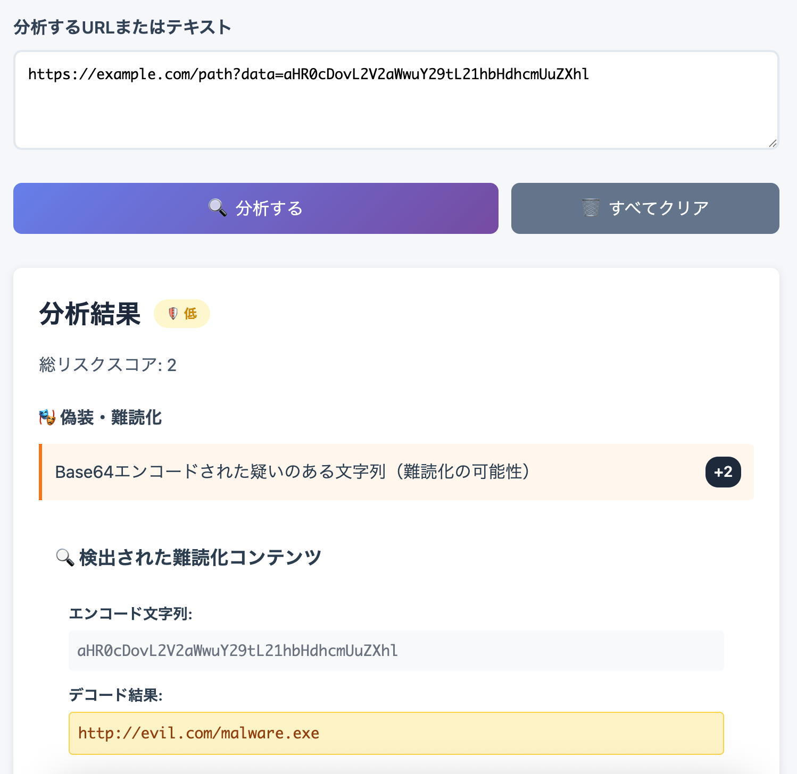

<!--
---
title: QR Risk Radar
category: security-tool
difficulty: 2
description: A lightweight client-side tool to assess the risk of QR codes and URLs/text. It decodes QR codes from camera or images and analyses the extracted content for potential phishing patterns. All processing occurs offline in the browser.
tags: [security, qr-code, phishing, risk-analysis, javascript, education]
demo: https://ipusiron.github.io/qr-risk-radar/
---
-->

# QR Risk Radar - QRコードリスク分析ツール


[](https://ipusiron.github.io/qr-risk-radar/)

**Day074 - 生成AIで作るセキュリティツール100**

**QR Risk Radar** は、QRコードやプレーンテキストに潜むリスクを検出するための軽量なクライアントサイドツールです。

ウェブカメラまたはアップロードした画像からQRコードを読み取り、抽出されたテキストやURLにフィッシングの兆候や悪意のあるパターンがないか検査します。
また、URLや任意の文字列を直接貼り付けて解析することもできます。

すべての処理はブラウザーー内で完結し、データがサーバーへ送信されることはありません。

---

## 🌐 デモページ

👉 **[https://ipusiron.github.io/qr-risk-radar/](https://ipusiron.github.io/qr-risk-radar/)**

ブラウザーーで直接お試しいただけます。

---

## 📸 スクリーンショット

>
>*危険なQRコードを検出*

---

## QRコード悪用の背景とツールの必要性

QRコードは非接触で簡単に情報を渡せる利便性から普及しましたが、その視覚的な信頼性を攻撃者が悪用する **クイッシング（QRコードを用いたフィッシング）** が深刻な脅威になっています。攻撃者はQRに悪意あるリンクを埋め込み、利用者を偽のログインページやマルウェア配布サイトに誘導して認証情報や機密データを盗みます。手口は多様で、フィッシングメール内のQR、飲食店メニューやポスターへの貼り替え、駐車メーター等の公共設備への偽ステッカー貼付など、オンライン／オフライン双方の経路で発生しています。

複数の調査によれば、こうしたQR利用の攻撃の約90%（報告では約89.3%）が認証情報や機密データの窃取を目的としており、一方で検出・報告が行われる割合は低く（報告例では約36%）、多くが見過ごされていることが示されています。これらの事実は、ユーザがコードを開く前に内容の安全性を手早く判定できる「簡易かつ信頼できるクイックチェックツール」の必要性を強く裏付けます。

---

## 👥 想定ユーザー

本ツールは以下のようなユーザーを想定して開発されています：

### 🎯 主な対象ユーザー

- **セキュリティ意識の高い一般ユーザー**
  - QRコードを安全に利用したい方
  - フィッシング攻撃から身を守りたい方
  - 怪しいURLやQRコードを事前にチェックしたい方

- **IT・セキュリティ関係者**
  - 企業のセキュリティ担当者
  - システム管理者
  - セキュリティコンサルタント
  - 情報セキュリティ教育の担当者

- **開発者・研究者**
  - セキュリティツールの開発者
  - セキュリティ研究者
  - 学生・研究機関の関係者
  - オープンソースプロジェクトの貢献者

- **教育関係者**
  - 情報セキュリティの講師
  - 企業研修の担当者
  - サイバーセキュリティ啓発活動の従事者

### 📋 利用場面

- **日常的な利用**: 街中のQRコードをスキャンする前の安全確認
- **企業セキュリティ**: 社内でのセキュリティ意識向上とトレーニング
- **教育・研修**: フィッシング攻撃の手口や対策の学習
- **セキュリティ監査**: 怪しいURLやQRコードの初期分析
- **開発・研究**: セキュリティツールの機能検証や改良のための参考

### 🌏 対象地域

主に **日本語圏のユーザー** を想定していますが、UIが直感的でわかりやすいため、他の言語圏のユーザーでも基本的な機能を利用できます。

---

## ✨ 本ツールの特徴

- **QRコードのデコード** – カメラまたはアップロードされた画像からQRコードを読み取り、外部サービスに接続することなくクライアントサイドで埋め込まれたテキストを抽出します。アップロードした場合でも元画像のプレビューとファイル情報を表示したまま解析できます。
- **手動入力の解析** – 入力ボックスにURLやテキストを貼り付けると、不審なパターンがないかチェックします。
- **リスク検出ルール** – 暗号化されていないHTTPリンクや危険なスキーム（`javascript:`, `data:` など）、IPアドレスのホスト、標準外のポート、URL短縮サービス、オープンリダイレクトパラメーターー、追跡パラメーターーの過剰使用、Punycodeドメイン、誤解を招くサブドメイン、過度に長いクエリやフラグメントといった問題を検出するヒューリスティックを備えています。
- **リスクレベル分類** – ルールに一致するごとにスコアを加算し、合計点に応じて Low／Medium／High の3段階に分類します。検出内容も併記されます。
- **オフライン動作** – 解析とデコードのすべてがブラウザーー内で実行され、ネットワーク通信は発生しません。
- **堅牢なスキャンエンジン** – まず `qr-scanner` のワーカーでデコードを試行し、ブラウザーやCSPの制約でワーカーが読み込めない場合は自動で `BarcodeDetector` API にフォールバックします（対応ブラウザー限定）。そのため、ローカルでの検証やネットワーク遮断環境でも安定して動作します。
- **シンプルなインターフェース** – カメラの開始・停止、画像ファイルの選択、手動解析を行うための明快な操作パネルを備えています。結果は色分けされたバッジで表示され、一目で判別できます。

---

## 📖 使い方

インターフェースはタブ形式になっており、**手動入力**と**QRスキャナー**の2つのモードを切り替えて使用できます。

### 📝 手動入力タブ

1. **URL・テキストの解析**  
   - 上部の「**手動入力**」タブをクリックします。  
   - テキストエリアに解析したいURLまたは任意のテキストを入力・貼り付けします。  
   - **分析する** ボタンをクリックすると、合計スコア、リスクレベルおよび検出された問題の一覧が表示されます。
   - **すべてクリア** ボタンで入力内容と結果をリセットできます。

2. **サンプルURLでのテスト**  
   - 「怪しいIPアドレス」「短縮URL」「危険なスキーム」のサンプルボタンをクリックすると、それぞれの例がテキストエリアに自動入力されます。

### 📷 QRスキャナータブ

1. **カメラでQRコードを読み取る**  
   - 上部の「**QRスキャナー**」タブをクリックします。  
   - **カメラ開始** ボタンをクリックし、ブラウザーーからカメラへのアクセス許可を求められたら許可します。  
   - QRコードをカメラにかざすと、自動的にデコードされ、内容と解析結果が表示されます。読み取り直後はカメラプレビューが自動で停止し、結果パネルと生成されたQRプレビューに切り替わります。  
   - **カメラ停止** ボタンでスキャンを終了できます。

2. **画像からQRコードを読み取る**  
   - **画像を選択** ボタンをクリックして、QRコードを含む画像（PNG・JPEG・SVG など）を選択します。  
   - 選択した画像はそのままプレビューされ、ファイル名とサイズを確認しながら解析できます。  
   - ワーカーが利用できない環境ではブラウザー組み込みの `BarcodeDetector` が自動的に使用され、対応していないブラウザーでは警告が表示されます。

### ✅ ホワイトリスト機能

- 画面下部の「信頼できるドメイン（ホワイトリスト）」セクションで、信頼するドメインを登録できます。
- ホワイトリストに登録されたドメインは、解析時に警告が表示されません。

---

## ⚙️ 検出ルールとスコアリング

QR Risk Radarは、デコードされたテキストやURLに対して一連のヒューリスティックチェックを適用します。

一致するルールごとに一定の点数が加算されます。
合計点からリスクレベルを算出し、Low = 0–2、Medium = 3–5、High = 6以上の3段階に分類します。

主なルールは次のとおりです。

- **HTTPスキーム** – `https://` ではなく `http://` を使用している (+2)  
- **危険なスキーム** – `javascript:`, `data:`, `file:`, `vbscript:` (+3)  
- **IPホスト** – URLのホストがIPアドレスである (+2)  
- **非標準ポート** – 80 または 443 以外のポートを使用している (+1)  
- **URL短縮サービス** – `bit.ly`, `t.co`, `tinyurl.com`, `is.gd`, `cutt.ly`, `goo.gl`, `ow.ly` など (+2)  
- **オープンリダイレクトパラメーター** – `url`, `redirect`, `next`, `dest` という名前のクエリパラメーター (+2)  
- **追跡パラメーターの過剰** – `utm_`, `fbclid`, `gclid` が3回以上出現する (+1)  
- **Punycodeドメイン** – ホスト名に `xn--` を含む (+2)  
- **疑わしいサブドメイン** – ベースドメインがサブドメイン部分に現れる（例：`example.com.evil.com`）(+2)  
- **過度に長い入力** – 入力が200文字を超える (+1)  
- **クエリやフラグメントの過多** – `&` が15個以上、またはフラグメント（`#`以降）が60文字以上 (+1)  
- **URLではない入力** – 入力が有効なURLでない場合、警告のみを表示しスコアは加算されません (0)  

これらのスコアリングの閾値はソースコードで調整できます。上記のルールはあくまでリスク評価の目安であり、リンクの安全性・危険性を完全に保証するものではありません。

### 📊 詳細なスコア判定アルゴリズム

現在実装されている20種類以上の検出ルール、各スコア、および高度な検出機能の詳細については、専用のドキュメントをご覧ください：

👉 **[スコア判定アルゴリズム詳細 (SCORING.md)](./SCORING.md)**

---

## 🎯 活用シナリオ

本ツールを実際に活用できる具体的なシナリオを3つご紹介します。

### 1. 📊 セキュリティ講演・研修でのデモンストレーション

**シナリオ**: 企業のセキュリティ研修や学会発表で、QRコードフィッシング（クイッシング）の脅威を実演

#### 活用方法

1. **事前準備**
   - 悪意のあるQRコードのサンプルを複数用意（`javascript:alert('XSS')`、怪しいIPアドレス、短縮URLなど）
   - 一見正常に見えるが、実際には危険なURLを含むQRコードを作成

2. **デモの流れ**
   - 受講者に「安全そうなQRコード」を見せ、直感的な判断を聞く
   - QR Risk Radarを使って実際にスキャン・解析を実行
   - リスクレベル（Medium/High）の表示とともに、具体的な脅威（IPアドレス直接指定、オープンリダイレクトなど）を解説
   - 「見た目では判断できない脅威」を視覚的に証明

3. **教育効果**
   - QRコードの盲目的な信頼の危険性を体感させる
   - 実際のツールを使った検証の重要性を伝える
   - フィッシング攻撃の多様性と巧妙さを理解してもらう

**デモ用サンプルURL例**:
```
http://192.168.1.100/login?redirect=http://evil-site.com
https://bit.ly/suspicious-link
javascript:window.location='http://malicious.com'
```

### 2. 🏁 CTF（Capture The Flag）競技での問題作成・解析

**シナリオ**: セキュリティ競技CTFにおいて、QRコード関連の問題を作成したり、既存問題を解析する

#### 問題作成者として

1. **QRコード解析問題の設計**
   - 複数のQRコードを提示し、その中から「最も危険なもの」を特定させる
   - Base64エンコードされたペイロードを含むQRコードを作成
   - 複数段階のリダイレクトを含むURL連鎖の問題を設計

2. **難易度調整**
   - 初級：明らかに危険なスキーム（`javascript:`など）
   - 中級：巧妙なオープンリダイレクト
   - 上級：Punycodeやサブドメインスプーフィングを組み合わせた複合攻撃

#### 参加者として

1. **問題解析プロセス**
   - 提供されたQRコード画像をツールにアップロード
   - 抽出されたURLをコピーし、手動入力タブで詳細解析
   - ホワイトリスト機能を活用して正規ドメインを除外
   - 複数のQRコードを効率的に比較・分析

2. **フラグ発見の手法**
   ```
   例：QRコードから抽出したURL
   https://example.com/path?data=aHR0cDovL2ZsYWctc2VydmVyLmNvbS9mbGFne3FyX2FuYWx5c2lzX21hc3Rlcn0%3D
   
   ↓ Base64デコード後
   http://flag-server.com/flag{qr_analysis_master}
   ```

### 3. 🏢 企業の情報セキュリティ監査・インシデント対応

**シナリオ**: 社内で不審なQRコードが発見された際の初期分析と対応判断

#### インシデント発生

某社の従業員から「エレベーター内に貼られた『Wi-Fi接続用』QRコードが怪しい」との報告が寄せられた。

#### 対応プロセス

1. **初期分析（5分以内）**
   - 現場でQRコードを撮影し、QR Risk Radarで即座に解析
   - 結果: `http://192.168.1.254:8080/wifi-setup.php?redirect=http://data-collector.evil.com`
   - リスクレベル: **High**（IPアドレス+非標準ポート+オープンリダイレクト）

2. **詳細調査**
   - 検出された脅威要素の分析:
     - IPアドレス直接指定 → 内部ネットワークを狙った攻撃の可能性
     - 非標準ポート8080 → 正規のWi-Fi設定とは異なる
     - オープンリダイレクト → 外部の悪意あるサイトへ誘導

3. **対応判断**
   - **即座に除去**：リスクレベルHighのため、QRコードを物理的に除去
   - **ネットワーク監視強化**：192.168.1.254への通信を監視
   - **社内通知**：類似の不審なQRコードへの注意喚起を全社展開
   - **ログ調査**：過去にこのIPアドレスへのアクセスがないか確認

4. **再発防止**
   - 物理セキュリティの見直し（不審な貼り物の定期チェック）
   - 従業員向けQRコードセキュリティ研修の実施
   - QR Risk Radarを社内ツールとして導入検討

#### 分析結果の報告書例
```
【QRコード脅威分析報告】
発見日時: 2024年XX月XX日 14:30
場所: 本社ビル3階エレベーター内
URL: http://192.168.1.254:8080/wifi-setup.php?redirect=http://data-collector.evil.com
リスクレベル: High (スコア: 7)
検出脅威:
- IPアドレス直接指定 (+2)
- 非標準ポート使用 (+1)
- HTTPスキーム (+2)
- オープンリダイレクト (+2)
推奨対応: 即座に除去・ネットワーク監視強化
```

### 4. 🔗 WeirdString Inspectorとの連携による高度な脅威分析

**シナリオ**: フィッシング攻撃の中でも特に検出困難なUnicode偽装攻撃やRTL制御文字を用いた巧妙な攻撃を精密分析

#### 分析対象

あるセキュリティ研究チームが、最近発見されたホモグラフ攻撃の手口を詳細分析する必要が生じました。

#### 連携分析プロセス

##### フェーズ1: QR Risk Radarによる初期スクリーニング

```
受領情報: 
- 不審なQRコードが記載されたフィッシングメール
- QRコード内URL: https://аррӏе.com/login/verify

QR Risk Radar分析結果:
- リスクレベル: High (スコア: 3)
- 検出ルール: Unicode偽装文字（ホモグラフ攻撃）
- 警告: キリル文字とASCII文字の混在を検出
```

##### フェーズ2: WeirdString Inspectorによる精密分析

研究チームがURLをWeirdString Inspectorに投入して詳細分析を実行：

```
WeirdString Inspector分析結果:
- 文字 'а' (U+0430) キリル文字小文字A → ASCII 'a'と99%類似
- 文字 'р' (U+0440) キリル文字小文字P → ASCII 'p'と99%類似  
- 文字 'ӏ' (U+04CF) キリル文字小文字PALOCHKA → ASCII 'l'と98%類似

攻撃分析:
- 偽装対象: apple.com
- 使用文字体系: キリル文字（ロシア語圏）
- 視覚的類似度: 極めて高い（人間には区別不可能）
- 攻撃の巧妙さ: レベル5（最高難度）
```

##### フェーズ3: 統合分析と対策立案

両ツールの結果を総合して包括的な脅威評価を実施：

```
【統合脅威分析レポート】

■ 攻撃概要
- 攻撃タイプ: 高度ホモグラフ攻撃
- 対象ブランド: Apple Inc.
- 使用技術: キリル文字偽装 + フィッシングページ

■ 技術的詳細
- QR Risk Radar検出: Unicode偽装パターン (+3pt)
- WeirdString Inspector検出: 3文字の巧妙な置換
- 総合危険度: 極高（レベル5/5）

■ 攻撃者プロファイル
- 技術レベル: 上級（国際化文字を熟知）
- 地理的示唆: キリル文字圏の可能性
- 標的: Apple IDユーザー

■ 対策提言
1. 即座対応: ドメインをセキュリティベンダーに報告
2. 短期対策: 従業員向けホモグラフ攻撃教育の実施
3. 長期対策: IDN表示ポリシーの厳格化検討
4. 技術的対策: 両ツールによる定期的なフィッシングサイト監視

■ 教育利用価値
- セキュリティ研修での実例として活用価値大
- Unicode攻撃の危険性を実証する最適な教材
- 技術的対策の重要性を示すデモンストレーション材料
```

#### 連携による付加価値

**QR Risk Radar単独では**:
- 「Unicode偽装文字の可能性」という警告のみ
- 具体的にどの文字が問題かは不明

**WeirdString Inspector連携により**:
- 具体的な偽装文字とコードポイントを特定
- 正規文字との視覚的類似度を定量化
- 攻撃者の技術レベルや地理的背景を推定可能
- より精密な対策立案が可能

#### 実務への応用

この連携分析手法は以下の場面で威力を発揮します：

1. **インシデント対応**: 迅速な初期判定→詳細分析→対策立案
2. **脅威研究**: 新たな攻撃手法の詳細解明
3. **セキュリティ教育**: 具体的な攻撃事例の教材作成
4. **防御システム開発**: 検出アルゴリズムの精度向上

---

### 🔗 WeirdString Inspectorとの連携

WeirdString Inspectorは、QR Risk Radarと併用することで、より包括的なセキュリティ分析が可能です。

👉 **[WeirdString Inspector](https://ipusiron.github.io/weirdstring-inspector/)** - Unicode文字列検査ツール

- **ホモグラフ攻撃の詳細分析**：QR Risk Radarで検出したUnicode偽装文字を詳細検査
- **不可視文字の検出**：ゼロ幅スペースなどの隠蔽文字を可視化
- **双方向テキスト操作の検出**：RTL/LTRマーカーによる文字列偽装を特定
- **文字コードポイント表示**：各文字のUnicodeコードポイントをホバー表示

#### 🔄 連携ワークフロー

**基本的な連携パターン**：
1. **QR Risk Radar** でQRコードや疑わしいURLを初期分析
2. Unicode関連の脅威が検出された場合、**WeirdString Inspector** で詳細検査
3. 両ツールの結果を組み合わせて包括的な脅威評価を実施

**具体的な連携シナリオ**は以下の通りです：

##### シナリオ1: ホモグラフ攻撃の精密分析
```
QR Risk Radar結果:
URL: https://аpple.com/login
リスクレベル: High (スコア: 3)
検出: Unicode偽装文字（ホモグラフ攻撃）

↓ WeirdString Inspectorで詳細分析

WeirdString Inspector結果:
- 文字 'а' (U+0430) - キリル文字小文字A
- 正規のASCII 'a' (U+0061) との視覚的類似性: 99%
- 攻撃タイプ: ドメイン偽装 (apple.com → аpple.com)
- 危険度: 極高 - 完全にapple.comと見分けがつかない
```

##### シナリオ2: 不可視文字による隠蔽攻撃
```
QR Risk Radar結果:
URL: https://example.com/login?token=abc[不可視文字]def
リスクレベル: Medium (スコア: 4)
検出: 異常な長さ + 疑わしいパラメーター

↓ WeirdString Inspectorで詳細分析

WeirdString Inspector結果:
- ゼロ幅スペース (U+200B) が3箇所に挿入
- ゼロ幅非結合子 (U+200C) がトークン内に隠蔽
- 実際のトークン: "abc[隠蔽コード]def"
- 攻撃目的: トークン解析回避・ログ汚染
```

##### シナリオ3: RTL/LTR操作による文字列偽装

```
QR Risk Radar結果:
URL: https://secure-bank‮moc.evil‬.com/login
リスクレベル: High (スコア: 5)
検出: 疑わしいサブドメイン構造

↓ WeirdString Inspectorで詳細分析

WeirdString Inspector結果:
- RTLオーバーライド (U+202E) 検出
- LTRオーバーライド (U+202C) 検出
- 実際の表示順序: "secure-bank[evil.com].com"
- 視覚的偽装: ユーザーには"secure-bank.com"に見える
- 攻撃手法: 双方向テキスト制御文字による偽装
```

##### 🛠️ 実際の連携操作手順

**ステップ1: QR Risk Radarでの初期スクリーニング**
1. QRコードをスキャン/URLを手動入力
2. リスク分析結果を確認
3. `Unicode偽装文字`や`疑わしいサブドメイン構造`が検出された場合 → ステップ2へ

**ステップ2: 問題のあるURLをコピー**
1. QR Risk Radarの分析結果画面で該当URLを選択・コピー
2. ブラウザーーで新しいタブを開く

**ステップ3: WeirdString Inspectorでの精密分析**
1. [WeirdString Inspector](https://ipusiron.github.io/weirdstring-inspector/)を開く
2. コピーしたURLを入力欄にペースト
3. `分析開始`をクリック

**ステップ4: 結果の統合評価**
1. **QR Risk Radar**: 総合的な脅威レベルとスコア
2. **WeirdString Inspector**: 具体的な偽装文字と手法
3. 両方の結果を組み合わせて最終的な危険度を判定

##### 📋 連携分析レポートテンプレート

```
【統合セキュリティ分析レポート】
分析日時: 2024-XX-XX XX:XX
分析対象: [QRコード/URL]

■ QR Risk Radar 分析結果
- リスクレベル: [Low/Medium/High]
- 総合スコア: X点
- 検出された脅威:
  • [検出ルール1] (+Xpt)
  • [検出ルール2] (+Xpt)

■ WeirdString Inspector 分析結果  
- Unicode異常: [有/無]
- 検出された偽装文字:
  • 文字: '[文字]' (U+XXXX) - [説明]
  • 類似度: XX%
- 攻撃手法: [ホモグラフ/不可視文字/RTL制御]

■ 統合評価
- 最終危険度: [極低/低/中/高/極高]
- 推奨対応: [アクセス回避/詳細調査/即座遮断]
- 備考: [その他の注意事項]
```

---

## 🚨 QRコードに関連する攻撃の詳細

👉 **[QRコード悪用の攻撃手法と事例](./ATTACKS.md)**

---

## 🔒 プライバシーとセキュリティ

すべての操作はブラウザー内で完結し、データがバックエンドへ送信されることはありません。QRコードのデコードライブラリはすべてJavaScriptで動作し、リスク解析は単純な文字列チェックに基づいています。ただし、このツールだけに依存するのではなく、常にURLを確認し、最新のセキュリティ対策を講じてください。

### 🔒 セキュリティ対策について

本ツールで実装されているセキュリティ機能や対策の詳細については、以下をご参照ください：

👉 **[セキュリティポリシー](./SECURITY.md)**

---

## 🔧 高度な難読化検出機能

本ツールでは、以下の高度な難読化技術を自動検出・解析します：

### Base64デコード機能
- **自動デコード**: Base64エンコードされた文字列を自動的に検出し、デコード結果を表示
- **内容分析**: デコード結果にURLや危険なスキームが含まれていないかチェック
- **可読性判定**: デコード結果が印刷可能文字かどうか判定し、意味のある内容のみ表示

### 検出される難読化パターン
- **過剰なHexエンコーディング**: 連続する8個以上のURL/Hexエンコード文字
- **二重URLエンコーディング**: `%25XX`形式の二重エンコード
- **Unicodeエスケープ**: `\uXXXX`形式のエスケープシーケンス
- **難読化IPアドレス**: 8進数(`0127.0.0.1`)、16進数(`0x7f000001`)、整数表現
- **疑わしいData URI**: 実行可能コンテンツを含むData URIスキーム

### 表示機能
デコードされた内容は専用セクションで表示され、以下の情報を提供します：
- 元のエンコード文字列（最初の50文字）
- デコード結果（最大200文字、以降は省略）
- 全体の文字数情報

---

## ⚠️ 制限事項

- 検出ルールはヒューリスティックであり、特定の脅威を見逃したり、無害なリンクを誤検知する可能性があります。結果はあくまで目安としてご利用ください。
- スキャナはプレーンテキストやURLを含むQRコードのみを対象とし、他の種類のバーコードは解釈しません。
- カメラへのアクセスには利用者の許可が必要であり、すべてのブラウザーやデバイスで利用できるとは限りません。また、画質が非常に悪い、もしくは歪んだQRコードは画像解析に失敗する可能性があります。

---

## 📁 ディレクトリー構成

```
qr-risk-radar/
├── 📄 index.html              # メインアプリケーション（QRスキャナー付きUI）
├── 📄 app.js                  # コアリスク検出ロジック（ヒューリスティックルール）
├── 📄 style.css               # スタイリング・レスポンシブデザイン
├── 📄 README.md               # プロジェクト概要・使用方法
├── 📄 SCORING.md              # スコア判定アルゴリズム詳細ドキュメント
├── 📄 ATTACKS.md              # QRコード悪用攻撃手法・事例集
├── 📄 SECURITY.md             # セキュリティポリシー・対策詳細
├── 📄 CLAUDE.md               # Claude Code向けプロジェクトガイダンス
├── 📄 LICENSE                 # MITライセンス
├── 📁 assets/                 # 画像・リソースファイル
│   └── 📄 screenshot.png      # アプリケーションスクリーンショット
└── 📁 test/                   # テスト・検証用リソース
    ├── 📄 TEST_CASES.md       # 200+の包括的テストケース集
    ├── 📄 TESTING_GUIDE.md    # 詳細テスト実行ガイド
    ├── 📄 QR_CATALOG.md       # 代表例QRコードカタログ
    ├── 📄 test-qr-generator.html  # テスト用QRコード生成ツール
    ├── 📄 generate-png-qr.html    # PNG形式QRコード生成器
    ├── 📄 generate-png-qr.js      # QRコード生成ロジック
    └── 📁 qr/                 # 事前生成済みテスト用QRコード
        ├── 📄 01_homograph_attack.svg    # ホモグラフ攻撃
        ├── 📄 05_dangerous_scheme.svg    # 危険なスキーム
        ├── 📄 09_shortened_url.svg       # 短縮URL
        ├── 📄 13_complex_attack.svg      # 複合攻撃
        ├── 📄 14_safe_url.svg            # 安全なURL
        └── ...                           # その他のテストパターン
```

---

## 🧪 テスト・検証用リソース

開発者やセキュリティ研究者向けに、QR Risk Radarの機能を包括的にテストできるリソースを提供しています：

### 📋 テストケース集
👉 **[test/TEST_CASES.md](./test/TEST_CASES.md)** - 200+の包括的テストケース

- **10カテゴリの脅威パターン**（フィッシング、難読化、技術的脅威など）
- **境界値・エッジケーステスト**
- **複合攻撃パターン**
- **自動テスト用JavaScriptスクリプト**

### 🎨 QRコード生成ツール  
👉 **[test/test-qr-generator.html](./test/test-qr-generator.html)** - テスト用QRコード生成器

- **16種類の脅威パターン**のQRコードを即座に生成
- **リスクレベル別の色分け表示**
- **一括生成・一括ダウンロード機能**
- **PNG/SVG/PDF形式対応**

### 📖 テスト実行ガイド
👉 **[test/TESTING_GUIDE.md](./test/TESTING_GUIDE.md)** - 詳細テスト手順書

- **5段階のテストフェーズ**
- **90項目のテストチェックリスト**  
- **パフォーマンス測定機能**
- **トラブルシューティングガイド**

### 📱 テスト用QRコード集
👉 **[test/QR_CATALOG.md](./test/QR_CATALOG.md)** - 代表例QRコードカタログ

- **14種類の代表的攻撃パターン**のQRコード（SVG形式）
- **各攻撃手法の詳細解説**
- **期待される検出結果**
- **即座にテスト可能**（QRコード生成不要）

### 🚀 クイックテスト

```bash
# 1. メインアプリケーションを開く
open index.html

# 2. QRコード生成ツールを開く  
open test/test-qr-generator.html

# 3. 即座にテスト（QRコード生成済み）
# test/qr/ 内の14種類のSVGファイルを直接スキャン可能

# 4. QRコードカタログでテスト内容を確認
open test/QR_CATALOG.md
```

これらのリソースにより、QR Risk Radarの**全機能を体系的に検証**できます。

### 🔧 関連ツール連携

**WeirdString Inspectorとの連携ワークフロー：**

1. **QR Risk Radarで初期検出**：ホモグラフ攻撃やUnicode偽装を検出
2. **WeirdString Inspectorで詳細分析**：検出されたURLを詳細検査
3. **具体的な偽装手法を特定**：使用されている偽装文字とUnicodeコードポイントを確認

**実践例：**
```
QR Risk Radar: 「https://аmazon.com/login」→ ホモグラフ攻撃検出
       ↓
WeirdString Inspector: キリル文字 'а' (U+0430) を可視化・特定
       ↓
対策: 正規ドメイン「amazon.com」との相違点を明確化
```

---

## 📄 ライセンス

MIT License – 詳細は [LICENSE](LICENSE) を参照してください。

---

## 🛠️ このツールについて

本ツールは、「生成AIで作るセキュリティツール100」プロジェクトの一環として開発されました。
このプロジェクトでは、AIの支援を活用しながら、セキュリティに関連するさまざまなツールを100日間にわたり制作・公開していく取り組みを行っています。

プロジェクトの詳細や他のツールについては、以下のページをご覧ください。

🔗 [https://akademeia.info/?page_id=42163](https://akademeia.info/?page_id=42163)
