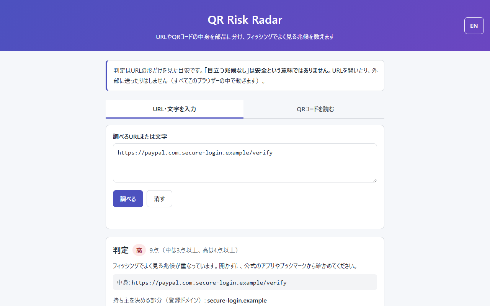
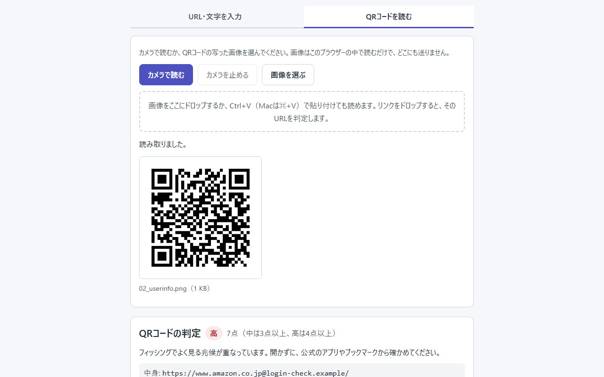
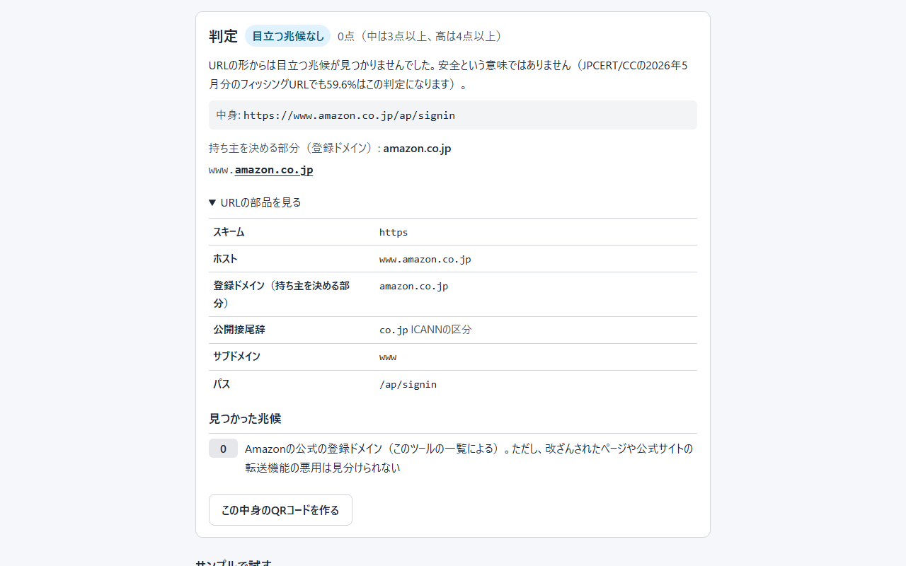
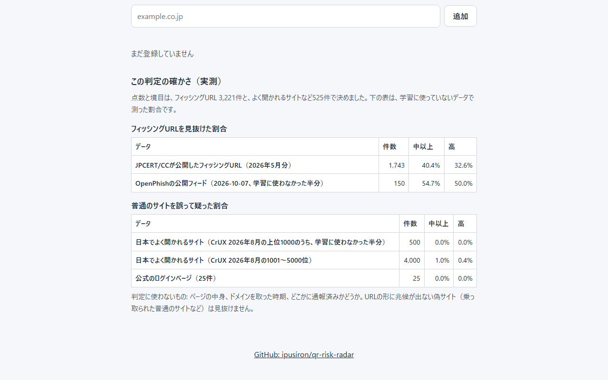
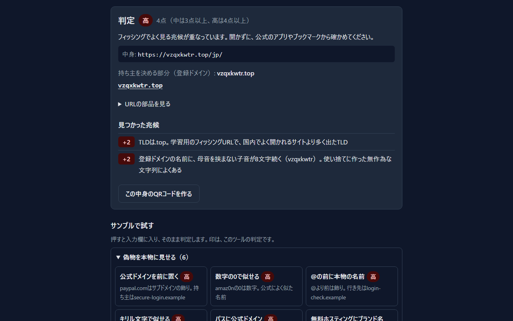

<!--
---
id: day074
slug: qr-risk-radar

title: "QR Risk Radar"

subtitle_ja: "QRコードリスク分析ツール"
subtitle_en: "QR Code Risk Analysis Tool"

description_ja: "URLやQRコードの中身を部品に分け、フィッシングでよく見る兆候を数えるWebツール。公開接尾辞の一覧で持ち主（登録ドメイン）を示し、兆候の点数と境目はJPCERT/CCなどの実データで決めて、見抜けた割合と誤って疑った割合を実測した。カメラや画像からQRコードを読み、すべての処理はブラウザーの中で完結する。"
description_en: "A web tool that breaks URLs and QR code contents into parts and counts common phishing signals. It shows the real owner (registrable domain) using the Public Suffix List, and its signal points and thresholds are calibrated on real data such as JPCERT/CC's phishing URL list, with measured detection and false-positive rates. It reads QR codes from the camera or images, and everything runs in the browser."

category_ja:
  - QRコード
  - フィッシング対策
category_en:
  - QR Code
  - Anti-Phishing

difficulty: 2

tags:
  - security
  - qr-code
  - phishing
  - quishing
  - risk-analysis
  - url-analysis
  - javascript
  - client-side
  - education

repo_url: "https://github.com/ipusiron/qr-risk-radar"
demo_url: "https://ipusiron.github.io/qr-risk-radar/"

hub: true
---
-->

# QR Risk Radar - QRコードリスク分析ツール


[](https://ipusiron.github.io/qr-risk-radar/)

**Day074 - 生成AIで作るセキュリティツール100**

**QR Risk Radar**は、URLやQRコードの中身を部品に分け、フィッシングでよく見る兆候を数えるWebツールです。

カメラや画像からQRコードを読み、持ち主を決める部分（登録ドメイン）をはっきり示したうえで、兆候ごとの点数を足して「高」「中」「目立つ兆候なし」を出します。点数と境目は実際のフィッシングURLと日本でよく開かれるサイトのデータで決め、その確かさを画面に載せています。すべての処理はブラウザーの中で完結し、URLを開いたり外部に送ったりはしません。

---

## 🌐 デモページ

👉 **[https://ipusiron.github.io/qr-risk-radar/](https://ipusiron.github.io/qr-risk-radar/)**

ブラウザーで直接お試しいただけます。

---

## 📸 スクリーンショット

>
>*公式ドメインを前に置いた偽のURL。持ち主はsecure-login.exampleで、判定は高（9点）*

>
>*QRコードの画像を読んだ画面。@の前のwww.amazon.co.jpは飾りで、行き先はlogin-check.example*

>
>*本物の公式サイト（amazon.co.jp）。URLの部品を開き、公開接尾辞co.jpと登録ドメインを示した状態*

>
>*判定の確かさ。学習に使っていないデータで測った、見抜けた割合と誤って疑った割合*

>
>*ダークモード。無作為な文字列のドメイン（.top）で、判定は高（4点）*

---

## ✨ 主な機能

- 持ち主の表示：ホスト名を「サブドメイン（薄い字）」と「登録ドメイン（太字・下線）」に分けて見せる。登録ドメインは公開接尾辞の一覧（Public Suffix List）で求めるので、`paypal.com.secure-login.example`の持ち主が`secure-login.example`だとわかる
- URLの部品：スキーム・@より前・ホスト・表示用の文字（国際化ドメイン名）・公開接尾辞とその区分・サブドメイン・ポート・パス・クエリ・フラグメントを表にする
- 兆候と点数：26種類の兆候を探し、兆候ごとの点数と説明を並べる。合計が3点以上で「中」、4点以上で「高」。`javascript:`・`data:`などは点数に関係なく「高」
- 隠れた行き先：クエリに埋め込まれたURLや、Base64で書いたURL・メールアドレスを取り出して見せ、ボタン1つでその行き先も判定する
- QRコードを読む：カメラ（スマートフォンでは背面のカメラ）か画像ファイルから読む。読めなかったときは前の結果を消して理由を示す
- QRコードを作る：調べた中身をQRコードのPNGにする。訓練の資料や、読み取りの試験に使える
- 判定の確かさ：学習に使っていないデータで測った「見抜けた割合」と「誤って疑った割合」を画面に載せる
- 自分で信頼するドメイン：社内のサイトなど、自分で確かめた登録ドメインを登録すると「信頼済み」と出る。公開接尾辞（`co.jp`・`pages.dev`など）は登録できない
- サンプル：手口ごとに18個。押すと入力欄に入り、そのまま判定する

---

## 📖 使い方

1. 「URL・文字を入力」タブに、調べるURLか文字を貼って「調べる」を押します（Ctrl+Enterでも動きます）
2. 判定の印と点数、持ち主（登録ドメイン）、見つかった兆候を確かめます。「URLの部品を見る」を開くと、部品ごとの表が出ます
3. QRコードは「QRコードを読む」タブで、「カメラで読む」か「画像を選ぶ」を使います。読み取った中身がそのまま判定されます
4. 調べた中身のQRコードがほしいときは、結果の下の「この中身のQRコードを作る」を押し、「PNGで保存」で保存します

「目立つ兆候なし」は、安全という意味ではありません。判定の結果だけで開くかどうかを決めず、送り主や公式のアプリ・ブックマークで確かめてください。

---

## 🔬 判定のしくみ

URLを部品に分け、登録ドメインを求めてから兆候を探します。点数は、学習用のフィッシングURL（JPCERT/CCの2026年4月分とOpenPhishの公開フィードの半分）と、日本でよく開かれるサイト（CrUXの上位1000の半分）と公式のログインページで、兆候が出る割合の比から決めました。データにほとんど出ない兆候は規則で決め、正規のサイトにもある特徴は上限を2点にしています。

兆候と点数の全表、境目の決め方、作り直す手順は[SCORING.md](SCORING.md)にあります。

### 判定の確かさ（学習に使っていないデータ）

| データ | 件数 | 中以上 | 高 | 意味 |
|---|---|---|---|---|
| JPCERT/CCが公開したフィッシングURL（2026年5月分） | 1,743 | 40.4% | 32.6% | 見抜けた割合 |
| OpenPhishの公開フィード（2026-10-07、学習に使わなかった半分） | 150 | 54.7% | 50.0% | 見抜けた割合 |
| 日本でよく開かれるサイト（CrUX 2026年8月の上位1000のうち、学習に使わなかった半分） | 500 | 0.0% | 0.0% | 誤って疑った割合 |
| 日本でよく開かれるサイト（CrUX 2026年8月の1001〜5000位） | 4,000 | 1.0% | 0.4% | 誤って疑った割合 |
| 公式のログインページ | 25 | 0.0% | 0.0% | 誤って疑った割合 |

JPCERT/CCの5月分の59.6%は「目立つ兆候なし」になります。乗っ取られた普通のサイトや、意味のある名前の使い捨てのドメインは、URLの形だけでは見分けられないためです。

---

## 🧪 サンプル

画面の「サンプルで試す」にある18個です。ドメインは例示用に予約された`.example`と`example.com`を使い、TLD・無料ホスティング・短縮URL・公式の例だけ実在の名前を使っています（ホスト名は架空です）。

| 分類 | サンプル | 中身 | 判定 |
|---|---|---|---|
| 偽物を本物に見せる | 公式ドメインを前に置く | `https://paypal.com.secure-login.example/verify` | 高（9点） |
| 偽物を本物に見せる | 数字の0で似せる | `https://amaz0n.example/signin` | 高（6点） |
| 偽物を本物に見せる | @の前に本物の名前 | `https://www.amazon.co.jp@login-check.example/` | 高（7点） |
| 偽物を本物に見せる | キリル文字で似せる | `https://аpple.example/` | 高（4点） |
| 偽物を本物に見せる | パスに公式ドメイン | `https://shop-news.example/vpass.ne.jp/login/` | 高（6点） |
| 偽物を本物に見せる | 無料ホスティングにブランド名 | `https://eki-net-login.pages.dev/` | 高（10点） |
| 使い捨てのドメイン | 無作為な文字列のドメイン | `https://vzqxkwtr.top/jp/` | 高（4点） |
| 使い捨てのドメイン | ドメイン名にsecure・account | `https://secure-account-update.example/` | 高（5点） |
| 行き先を隠す | 10進数で書いたIPアドレス | `http://3232235777/login` | 高（5点） |
| 行き先を隠す | 短縮URL | `https://bit.ly/3xY9Abc` | 目立つ兆候なし（1点） |
| 行き先を隠す | URLの中に別のURL | `https://example.com/redirect?url=https://login-check.example/` | 目立つ兆候なし（2点） |
| 行き先を隠す | Base64で隠した行き先 | `https://example.com/track?data=aHR0cHM6Ly9sb2dpbi1jaGVjay5leGFtcGxlLw` | 目立つ兆候なし（0点） |
| 行き先を隠す | 二重の拡張子のファイル | `https://files.example/invoice.pdf.exe` | 目立つ兆候なし（1点） |
| URLではないもの | javascript:スキーム | `javascript:alert('QR Risk Radar')` | 高 |
| URLではないもの | data:スキーム | `data:text/html,<h1>QR Risk Radar</h1>` | 高 |
| URLではないもの | Wi-Fiの設定 | `WIFI:T:WPA;S:Free-Cafe-WiFi;P:12345678;;` | URL以外 |
| 本物（比べるため） | Amazonの公式のログイン | `https://www.amazon.co.jp/ap/signin` | 目立つ兆候なし（0点） |
| 本物（比べるため） | 日本郵便の公式 | `https://www.post.japanpost.jp/` | 目立つ兆候なし（0点） |

「行き先を隠す」の4つは「目立つ兆候なし」になります。短縮URLや転送は正規の使い方も多いので、それだけでは点を高くしていません。画面では、埋め込まれた行き先を取り出して見せ、「このURLを調べる」でその行き先も判定できます。

### 読み取りの試験に使えるQRコードの画像

`samples/qr/`の9枚は、上のサンプルを`tools/make-qr.mjs`でQRコードにしたものです（画面の「QRコードを作る」と同じ作り方）。

| ファイル | 中身 | 判定 |
|---|---|---|
| `samples/qr/01_fake-official.png` | `https://paypal.com.secure-login.example/verify` | 高（9点） |
| `samples/qr/02_userinfo.png` | `https://www.amazon.co.jp@login-check.example/` | 高（7点） |
| `samples/qr/03_homograph.png` | `https://аpple.example/` | 高（4点） |
| `samples/qr/04_hosting.png` | `https://eki-net-login.pages.dev/` | 高（10点） |
| `samples/qr/05_random.png` | `https://vzqxkwtr.top/jp/` | 高（4点） |
| `samples/qr/06_shortener.png` | `https://bit.ly/3xY9Abc` | 目立つ兆候なし（1点） |
| `samples/qr/07_javascript.png` | `javascript:alert('QR Risk Radar')` | 高 |
| `samples/qr/08_wifi.png` | `WIFI:T:WPA;S:Free-Cafe-WiFi;P:12345678;;` | URL以外 |
| `samples/qr/09_official.png` | `https://www.amazon.co.jp/ap/signin` | 目立つ兆候なし（0点） |

`test/qr/`にも、以前から置いている5種類（PNGとSVG）があります。

| ファイル | 中身 | 判定 |
|---|---|---|
| `test/qr/01_homograph_attack.png`・`.svg` | `https://аmazon.com/login` | 高（5点） |
| `test/qr/05_dangerous_scheme.png`・`.svg` | `javascript:alert('XSS Test')` | 高 |
| `test/qr/09_shortened_url.png`・`.svg` | `https://bit.ly/3xY9Abc` | 目立つ兆候なし（1点） |
| `test/qr/13_complex_attack.png`・`.svg` | `javascript:window.location='http://192.168.1.1:8080/malware.exe'` | 高 |
| `test/qr/14_safe_url.png`・`.svg` | `https://www.google.com/` | 目立つ兆候なし（0点） |

---

## 🎯 ユースケース

- 家族のスマートフォンに届いたSMSの確認：開く前にURLを貼り、持ち主（登録ドメイン）が本当にその会社のものかを家族と一緒に確かめる。「目立つ兆候なし」でも、公式のアプリから同じ用件を確かめる習慣づくりに使える
- 社内のフィッシング訓練：偽のURLのQRコードを画面で作って訓練用の掲示物に載せ、読み取った人がツールで持ち主を確かめるところまでを体験してもらう。訓練用であることを掲示物に必ず書き添える
- 店舗・施設のQRコードの点検：自分の店のメニューや支払いの案内に、偽のシールが重ねて貼られていないかを定期的に読み取って確かめる。自店の登録ドメインを「自分で信頼するドメイン」に入れておくと、本物なら「信頼済み」と出る
- 情報の授業：URLの構造（スキーム・ホスト・登録ドメイン・パス）を教える教材にする。「左から読むと騙される」「`@`の前は飾り」を、サンプルを押しながら生徒が自分で確かめられる
- Webサイトの運営：自社が配るURL（キャンペーン用のドメイン・短縮URL・転送）が、受け取った人の目にどう映るかを点検する。正規のURLが「中」以上になるなら、ドメインの選び方や配り方を見直す材料になる
- 印刷物・名刺の入稿前の確認：印刷するQRコードの画像を読み、中身が意図したURLか、余計な追跡の値が付いていないかを確かめる
- Wi-Fiの設定のQRコード：カフェやイベント会場の掲示を読み、ネットワーク名と暗号方式を、つなぐ前に店の案内と見比べる
- セキュリティの学習・研修の講師：日本で実際に多い形（無作為な文字列のドメイン、無料ホスティング、パスに公式ドメイン）を、点数の表と一緒に説明する。点数の根拠が実データの件数で示されているので、「なぜ怪しいか」を数字で語れる
- 研究・調べもの：`tools/calibrate.mjs`に別の月のフィッシングURLの一覧を入れ、兆候の出方の変化や、境目を変えたときの見抜けた割合と誤って疑った割合の動きを測る
- CTF・謎解きの作問：見た目と持ち主が食い違うURL（`@`・キリル文字・公開接尾辞の境目）を題材にした問題を作り、解説にこのツールの部品の表を使う
- ほかのツールとの組み合わせ：ホストに紛らわしい文字があれば[WeirdString Inspector](https://ipusiron.github.io/weirdstring-inspector/)（Day023）で1文字ずつ確かめる。人に送る前のURLから追跡用の値を落とすには[URLPurifier](https://ipusiron.github.io/urlpurifier/)（Day039）を使う

判定はURLの形だけを見た目安で、安全の証明には使えません。作者は悪用を勧めません。

---

## 🔒 セキュリティ

- 入力・読み取った中身・画像はブラウザーの外へ送らない。URLを開かない（リンクにしない）
- Content Security Policyで、スクリプトとスタイルを同じ場所のファイルだけに限る（`default-src 'none'`、`connect-src`なし）。インラインのスクリプト・イベントハンドラー・style属性を使わない
- QRコードのライブラリーは`vendor/`に置き、CDNから読まない。配布物との一致をテストがSHA-256で確かめる
- 入力は`textContent`で描画する

詳しくは[SECURITY.md](SECURITY.md)にあります。

---

## ⚠️ 注意と限界

- 「目立つ兆候なし」は安全という意味ではない。JPCERT/CCの2026年5月分のフィッシングURLの59.6%はこの判定になる
- ページの中身、ドメインを取った時期、どこかに通報済みかどうかは見ない（外部に問い合わせないため）
- 偽装の兆候は、一覧にある30ブランド（公式の登録ドメイン55件）だけを見る。一覧にないブランドや、一覧にない公式のドメイン（子会社・キャンペーン用など）は区別できない
- 公式のドメインでも、改ざんされたページや、公式サイトの転送機能の悪用は見分けられない
- 短縮URLの行き先は展開しない（外部に問い合わせないため）
- カメラは、httpsで開いたページか、ファイルを直接開いたとき（`file://`）、`localhost`で使える

---

## ❓ よくある質問（FAQ）

### Q. 「目立つ兆候なし」なら開いてよいですか？

A. いいえ。URLの形に兆候が出ないフィッシングは多く、JPCERT/CCの2026年5月分では59.6%がこの判定になりました。送り主や、公式のアプリ・ブックマークから同じ用件を確かめてください。

### Q. 本物の会社のURLなのに「中」以上になりました。

A. 一覧にない公式のドメイン（キャンペーン用など）は、ドメインの形だけで判定されます。自分で確かめたドメインなら「自分で信頼するドメイン」に登録すると「信頼済み」と出ます。

### Q. 短縮URLはなぜ「中」にならないのですか？

A. 短縮URLは正規の案内にも広く使われ、それだけで疑うと誤って疑う割合が増えるためです（1点）。行き先はこのツールでは展開しません。

### Q. ブランドを一覧に足してほしいです。

A. `js/url-core.js`の`BRANDS`に、名前・探す語・公式の登録ドメインを足します。足したら`node tools/calibrate.mjs`で点数を測り直します（データの置き方は[SCORING.md](SCORING.md)）。

### Q. 読み取った中身や画像はどこかに送られますか？

A. 送られません。画像もブラウザーの中で読むだけです。保存するのは「自分で信頼するドメイン」の一覧だけで、このブラウザーの中（localStorage）に置きます。

---

## 📚 関連資料

- [SCORING.md](SCORING.md)：兆候と点数の全表、境目の決め方、評価、限界、作り直す手順
- [SECURITY.md](SECURITY.md)：安全対策と問題の報告先
- [ATTACKS.md](ATTACKS.md)：QRコードを使った攻撃の手口と事例
- [vendor/README.md](vendor/README.md)：外部のライブラリーの出所と版

---

## 🧪 テスト

```bash
npm test
```

- Node.js 22以上で動きます。依存パッケージはありません
- 公開接尾辞の一覧の公式のテストベクター、兆候と点数、サンプルの判定、`samples/qr/`の画像の中身（画素で比べる）、`vendor/`のSHA-256、`index.html`とCSP、配色のコントラスト比、行の長さ、READMEとSCORING.mdの表を検証します
- 表の数値（判定の確かさ・兆候の点数・サンプルの判定）は、`js/model.js`と計算部から作り直して照合します
- GitHub Actionsでpushとpull_requestのたびに自動で実行します

`js/psl-data.js`・`js/qr-worker.js`・`samples/qr/`は生成物です。`node tools/build-psl.mjs --check`・`node tools/build-worker.mjs --check`・`node tools/make-qr.mjs --check`で最新かを確かめられます。

---

## 🔗 参考文献

- [Public Suffix List](https://publicsuffix.org/)（Mozilla Public License 2.0）
- [WHATWG URL Standard](https://url.spec.whatwg.org/)
- [RFC 3492: Punycode](https://www.rfc-editor.org/rfc/rfc3492)
- [JPCERTCC/phishurl-list](https://github.com/JPCERTCC/phishurl-list)（JPCERT/CCが公開するフィッシングURLの一覧）
- [OpenPhish](https://openphish.com/)（公開フィード）
- [zakird/crux-top-lists](https://github.com/zakird/crux-top-lists)（Chrome UX Reportの国別の上位のサイト）
- [Tranco](https://tranco-list.eu/)（人気サイトの一覧。公式ドメインの確認に使用）
- [nimiq/qr-scanner](https://github.com/nimiq/qr-scanner)・[kazuhikoarase/qrcode-generator](https://github.com/kazuhikoarase/qrcode-generator)
- [WAI-ARIA Authoring Practices: Tabs](https://www.w3.org/WAI/ARIA/apg/patterns/tabs/)

---

## 📁 ディレクトリー構造

```text
qr-risk-radar/
├── .github/                              # GitHubの設定
│   └── workflows/                        # GitHub Actionsのワークフロー
│       └── test.yml                      # pushとpull_requestでnpm testを実行
├── assets/                               # 画像
│   ├── favicon.svg                       # タブのアイコン
│   ├── screenshot.png                    # スクリーンショット（偽のURLの判定）
│   ├── screenshot2.png                   # スクリーンショット（QRコードの画像を読む）
│   ├── screenshot3.png                   # スクリーンショット（本物の公式サイトとURLの部品）
│   ├── screenshot4.png                   # スクリーンショット（判定の確かさ）
│   └── screenshot5.png                   # スクリーンショット（ダークモード）
├── js/                                   # 画面から読むスクリプト
│   ├── messages.js                       # 画面の文言と兆候の説明（日本語）
│   ├── model.js                          # 生成物：兆候の点数・境目・評価（tools/calibrate.mjsが作る）
│   ├── psl-data.js                       # 生成物：公開接尾辞の一覧（tools/build-psl.mjsが作る）
│   ├── qr-worker.js                      # 生成物：QRコードのデコーダー（tools/build-worker.mjsが作る）
│   ├── samples.js                        # 学習用のサンプル（画面のボタンとsamples/qr/の元）
│   └── url-core.js                       # 計算部：URLの分解・登録ドメイン・兆候・点数
├── samples/                              # サンプルのファイル
│   └── qr/                               # 読み取りの試験に使うQRコードの画像
│       ├── 01_fake-official.png          # 公式ドメインを前に置く
│       ├── 02_userinfo.png               # @の前に本物の名前
│       ├── 03_homograph.png              # キリル文字で似せる
│       ├── 04_hosting.png                # 無料ホスティングにブランド名
│       ├── 05_random.png                 # 無作為な文字列のドメイン
│       ├── 06_shortener.png              # 短縮URL
│       ├── 07_javascript.png             # javascript:スキーム
│       ├── 08_wifi.png                   # Wi-Fiの設定
│       └── 09_official.png               # Amazonの公式のログイン
├── test/                                 # 自動テスト（node --test）と試験用の画像
│   ├── core.test.js                      # 兆候と点数、model.jsの形
│   ├── format.test.js                    # 行の長さ、app.jsに日本語の文字列がないこと
│   ├── html.test.js                      # index.htmlとCSP、タブ、配色のコントラスト比
│   ├── load.js                           # テストで計算部を読み込む
│   ├── psl.test.js                       # 公開接尾辞の一覧（公式のテストベクター・生成物）
│   ├── qr/                               # 以前から置いている試験用のQRコード
│   │   ├── 01_homograph_attack.png       # キリル文字のаmazon.com（PNG）
│   │   ├── 01_homograph_attack.svg       # 同（SVG）
│   │   ├── 05_dangerous_scheme.png       # javascript:スキーム（PNG）
│   │   ├── 05_dangerous_scheme.svg       # 同（SVG）
│   │   ├── 09_shortened_url.png          # 短縮URL（PNG）
│   │   ├── 09_shortened_url.svg          # 同（SVG）
│   │   ├── 13_complex_attack.png         # javascript:でIPアドレスへ転送（PNG）
│   │   ├── 13_complex_attack.svg         # 同（SVG）
│   │   ├── 14_safe_url.png               # 公式サイト（PNG）
│   │   └── 14_safe_url.svg               # 同（SVG）
│   ├── readme.test.js                    # README・SCORING.mdの表とYAML、ディレクトリー構造
│   ├── samples.test.js                   # サンプルの判定、QRコードの画像、兆候の説明、CRC-32
│   ├── test_psl.txt                      # 公開接尾辞の一覧の公式のテストベクター
│   └── vendor.test.js                    # vendor/のSHA-256とqr-worker.jsの生成
├── tools/                                # 生成と校正のスクリプト（Node.js）
│   ├── build-psl.mjs                     # 公開接尾辞の一覧からjs/psl-data.jsを作る
│   ├── build-worker.mjs                  # vendorのデコーダーからjs/qr-worker.jsを作る
│   ├── calibrate.mjs                     # 実データで点数と境目を決め、js/model.jsを作る
│   ├── make-qr.mjs                       # サンプルからsamples/qr/の画像を作る
│   └── public_suffix_list.dat            # 公開接尾辞の一覧（2026-10-01版、MPL-2.0）
├── vendor/                               # 外部のライブラリー（npmの配布物のまま）
│   ├── README.md                         # 出所・版・更新の手順
│   ├── qr-scanner/                       # QRコードを読むライブラリー（MIT）
│   │   ├── LICENSE                       # ライセンス
│   │   ├── qr-scanner-worker.min.js      # デコーダー
│   │   ├── qr-scanner-worker.min.js.map  # 同（ソースマップ）
│   │   ├── qr-scanner.umd.min.js         # 本体
│   │   └── qr-scanner.umd.min.js.map     # 同（ソースマップ）
│   └── qrcode-generator/                 # QRコードを作るライブラリー（MIT）
│       ├── LICENSE                       # ライセンス
│       └── qrcode.js                     # 本体
├── .gitattributes                        # vendor/などの改行を変換しない
├── .gitignore                            # Gitの除外（tools/corpus/など）
├── .htaccess                             # Apacheに置くときのヘッダー
├── .nojekyll                             # GitHub PagesでJekyllを使わない
├── ATTACKS.md                            # QRコードを使った攻撃の手口と事例
├── CLAUDE.md                             # Claude Code向けの開発メモ
├── LICENSE                               # MITライセンス
├── README.md                             # このファイル
├── SCORING.md                            # 点数と判定のしくみ
├── SECURITY.md                           # 安全対策と問題の報告先
├── app.js                                # 画面の制御（入力・結果・QRコードの読み取りと生成）
├── index.html                            # 画面
├── package.json                          # npm testの定義（依存なし）
└── style.css                             # スタイルシート（ライト・ダーク）
```

---

## 💻 動作環境

- Chromium系のブラウザー（Chrome・Edge）とFirefoxで動作を確かめています
- サーバーは不要で、index.htmlをブラウザーで直接開いても、画像からの読み取りとカメラを含めて動きます。ローカルのサーバーで開く場合は`python -m http.server 8000`を実行し、http://localhost:8000/ を開きます
- カメラは、httpsで開いたページ、`localhost`、ファイルを直接開いたときに使えます

---

## 📄 ライセンス

MIT License – 詳細は[LICENSE](LICENSE)を参照してください。

`vendor/`のライブラリーはそれぞれのMITライセンス、`tools/public_suffix_list.dat`と`js/psl-data.js`はMozilla Public License 2.0です。

---

## 🛠️ このツールについて

本ツールは、「生成AIで作るセキュリティツール100」プロジェクトの一環として開発されました。
このプロジェクトでは、AIの支援を活用しながら、セキュリティに関連するさまざまなツールを100日間にわたり制作・公開していく取り組みを行っています。

プロジェクトの詳細や他のツールについては、以下のページをご覧ください。

🔗 [https://akademeia.info/?page_id=42163](https://akademeia.info/?page_id=42163)
